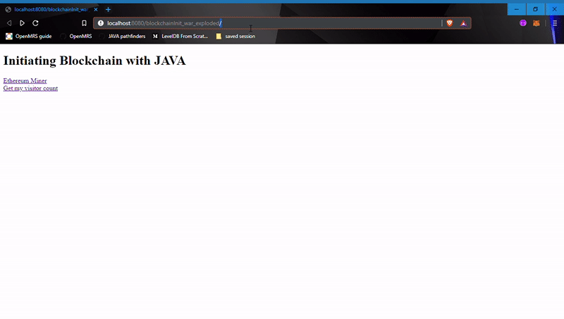

<h1 align="center">Blockchain with Java</h1>
<h3 align="center">Initiating Blockchain and Ethereum in Java</h3>

This repository implements deploying a  smart contract,connecting a smart contract with `web3j`,hashing files with sha256,creating a `Spring MVC` webapp with a smart contract and creating a `Spring REST` handler to hash Strings in sha256 

<h3 align="center">Webapp features</h4>
- The webapp implements a simple counter with increment and decrement options by using the smart ccontract
- It counts the number of visitors again with the use of a smart contract

<h4 align="center">Background</h4>

For Hashing and Recovering files explore **com.blockchainInit.encodingFiles** package

For Creating a Rest handler and implementing a simple blockchain explore **com.blockchainInit.webservice** package

For Creating a webapp with a smartcontract explore **com.blockchainInit.MVC** after: 

- Compile the solidity file with `solcjs` command `solcjs HelloWorld.sol --bin --abi --optimize -o ./ `
- Create a java wrapper with web3j CLI command `web3j solidity generate --binFile=HelloWorld_sol_HelloWorld.bin --abiFile=HelloWorld_sol_HelloWorld.abi -o . -p org.your.package.name`
- Use this java wrapper to interact with your smart contract ,I have used ganache for my testing.

 

<h4 align="center">Technologies used</h4>

- `Ethereum`
- `Solidity`
- `Web3j` 
- `Ganache`
- `Spring MVC` 
- `Spring Rest`

### Thanks for Reading 😄
